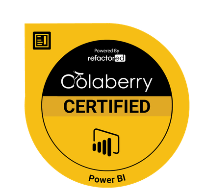
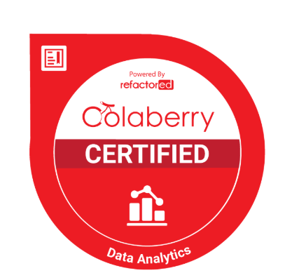

# Hi, I'm Donald Gray

   **Senior Business Intelligence Developer**  
   Power BI • Azure • Microsoft Fabric • SQL • Data Modeling • Machine Learning  
   I use data to uncover trends, optimize decision-making, and deliver powerful visuals.

---

## Featured Project

 ###  [Iowa Housing Sales Dashboard](https://github.com/Dgrey628/Iowa-Housing-Sales-Dashboard)  
 An interactive Power BI dashboard analyzing 130+ years of Iowa housing data with ML-powered pricing predictions using XGBoost.  
 Includes pricing trends, property insights, ROI analysis, and predictive modeling.  
 [View Live Dashboard](https://app.powerbi.com/view?r=eyJrIjoiMmEwM2VkOTQtODY3My00NmQxLTgzMGEtMTVjNTM5YmY0ZjlkIiwidCI6ImYxYWQ2ODFmLTZmNjItNDNhOS04MjQxLTA3MDMxNjBlMTM0OCIsImMiOjN9)

---

##  Let's Connect

 **Email:** djgray433@gmail.com  
 **LinkedIn:** [donald-gray-9576119b](https://www.linkedin.com/in/donald-gray-9576119b/)  
 

---

##  Certifications

  
  &nbsp;
  

---

## 🛠 Tools & Skills

> “Turning data into decisions – one dashboard at a time.”

---

<!---
Dgreay628/Dgreay628 is a ✨ special ✨ repository because its `README.md` (this file) appears on your GitHub profile.
You can click the Preview link to take a look at your changes.
--->
